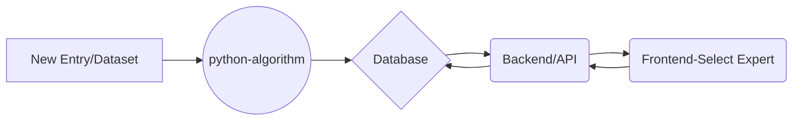

# AU-CFR


Flow chart:


Clone the project
-
```shell
git clone https://github.com/BeAgarwal/AU-CFR.git
cd AU-CFR
```
For **go-backend:**
- 
- `cd go-backend`
- Run this command `go get`. It will download all packages automatically. Make sure you are connected with Internet.
- Run `cp .env.sample .env`
- Edit `.env` to setup config for database or server
- Run command `go run main.go` in order to start backend server. 

For **react-frontend:**
-
```shell
cd react-frontend
npm install
npm start
```

For **python-algorithm:**
-
- Give the excel sheet dataset path in `main.py` file
- Run command `python3 main.py` in order to run
-  If you want to use database for output instead of excel sheet, then uncomment the code in `main.py` for inserting result into database